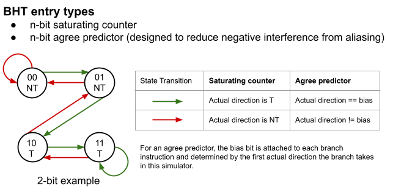
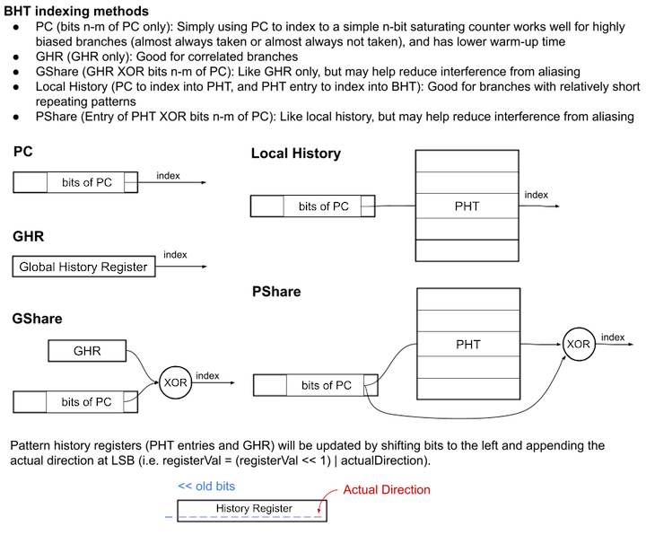

# branch-prediction-visualization

Visualize and compare different branch prediction methods using Python and Tkinter GUI.  

Currently only shows branch direction predictions (taken or not taken), not branch target address predictions or branch instruction predictions (determining whether instruction is branch), since these can generally be done efficiently with a branch target buffer (BTB) and return address stack (RAS) for function returns.  

Note that this tool is simply to be used for visualizing and better understanding branch prediction accuracy of different branch prediction methods under different taken / not taken situations, not for rigorous testing for comparison between the methods.  

## Branch prediction methods covered (or in the works)
Compare between simple n-bit saturating counters or simulate custom branch predictor with the following architecture and choices:

- BHT entry types
    - n-bit saturating counters
    - *n-bit agree predictor (bias bit set based on first direction) -- not fully implemented yet*

- Indexing methods for BHT
    - PC
    - GHR
    - GHR XOR PC (GShare)
    - PHT entry XOR PC (PShare)
    - PC index PHT, PHT entry index BHT (Local History)

- Input: list of (PC of branch instruction, T or NT)

## Other
Ideas to (maybe) implement and more state-of-the-art prediction methods.

- Perceptron branch prediction  
- Multiple predictors
    - Meta predictor; predictor for predictors (e.g. Alpha 21264 Tournament Predictor)
    - Majority vote method (gskewed), predictor fusion, partial tagging, adder tree
- More misprediction stats (e.g. input a # of stages to flush for each misprediction, and it'll tell you the slowdown rate compared to perfect prediction)
- Sample T/NT patterns representing loop branches, dependent branches, etc. to show how different methods are better in certain cases.
- Alloyed-history predictors: concatenate local and global history to use as index
- Geometric history length predictors: TAGE, O-GEHL
- n by n predictors: Multiple arrays of predictors, use PC to select index, then use GHR to select array.
- YAGS
- Detect loop branch and count iterations (Intel Pentium M)

## Usage and Dependencies
Make sure Tkinter and pillow are installed, and open/run `main.py` with Python 3.X. Below is an example simulation of branch instructions using the Local History prediction method, with a 16-entry local pattern history table and 8-entry branch history table.

## References
- Agree predictors:  
Eric Sprangle, Robert S. Chappell, Mitch Alsup, and Yale N. Patt. 1997. The agree predictor: a mechanism for reducing negative branch history interference. SIGARCH Comput. Archit. News 25, 2 (May 1997), 284–291. DOI:https://doi.org/10.1145/384286.264210  
- [Combining Branch Predictors](https://www.hpl.hp.com/techreports/Compaq-DEC/WRL-TN-36.pdf?source=aw&subacctid=78888&subacctname=Skimlinks&adcampaigngroup=91539&awc=7168_1634183649_7110ed148465d8d1f132fb09063d57ff&jumpid=af_gen_nc_ns&utm_medium=af&utm_source=aw&utm_campaign=Skimlinks) by Scott McFarling
- Yeh and Patt, "Two-Level Adaptive Training Branch Prediction," MICRO 1991.

https://www.cc.gatech.edu/~hyesoon/fall11/lec_br2.pdf