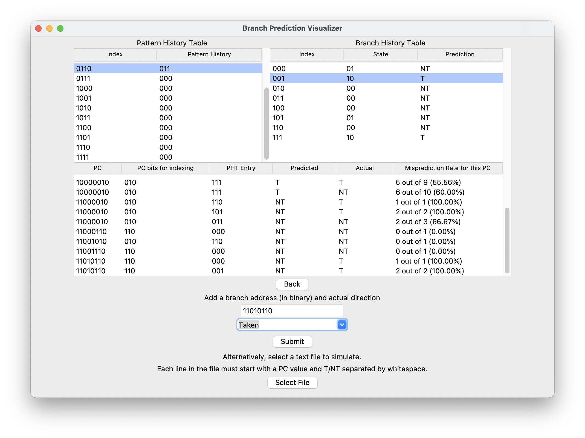

# branch-prediction-visualization

Tool for visualizing and comparing different dynamic branch prediction methods for a pipelined processor.

Currently only shows branch direction predictions (taken or not taken), not branch target address predictions or branch instruction predictions (determining whether instruction is branch), since these can generally be done efficiently for direct branches with a branch target buffer (BTB) and return address stack (RAS) for function returns.  

Note that this tool is simply to be used for visualizing and better understanding branch prediction accuracy of different branch prediction methods under different branch patterns, not for rigorous testing for comparison between the methods.  

## Branch prediction methods covered (or in the works)
Compare between simple n-bit saturating counters or simulate custom branch predictor with the following architecture and choices:

- BHT entry types
    - n-bit saturating counters
    - n-bit agree predictor (bias bit set based on first direction)
        - The "Bias Bit Table" displayed would likely be part of the BTB or I-cache.

- Indexing methods for BHT
    - PC
    - GHR
    - GHR XOR PC (GShare)
    - PHT entry XOR PC (PShare)
    - PC index PHT, PHT entry index BHT (Local History)

- Input: list of (PC of branch instruction, T or NT)

## Other
Ideas to (maybe) implement and more state-of-the-art prediction methods.

- [Perceptron branch prediction](https://www.cs.utexas.edu/~lin/papers/hpca01.pdf)
- Multiple predictors
    - Meta predictor; predictor for predictors (e.g. [Alpha 21264](https://cseweb.ucsd.edu//classes/sp00/cse241/alpha.pdf) Tournament Predictor)
    - Majority vote method ([skewed](https://citeseerx.ist.psu.edu/viewdoc/download?doi=10.1.1.34.3641&rep=rep1&type=pdf)), predictor fusion, partial tagging, adder tree
- Alloyed-history predictors: concatenate local and global history to use as index
- Geometric history length predictors: [TAGE](https://jilp.org/vol8/v8paper1.pdf), [O-GEHL](https://ieeexplore.ieee.org/document/1431573)
- n by n predictors: Multiple arrays of predictors, use PC to select index, then use GHR to select array.
- [YAGS](https://ieeexplore.ieee.org/document/742770)
- Detect loop branch and count iterations (Intel Pentium M)
- Additional features
    - More misprediction stats (e.g. input a # of stages to flush for each misprediction, and it'll tell you the slowdown rate compared to perfect prediction)
    - Sample T/NT patterns representing loop branches, dependent branches, etc. to show how different methods are better in certain cases.
    - custom n-m bits of PC for indexing. Currently, lowest bits are used by default.
    - More diagram-like UI

## Usage and Dependencies
Make sure Tkinter and pillow are installed, and launch/run `main.py` with Python 3.X.   
Below is an example simulation of branch instructions using the Local History prediction method, with a 16-entry local pattern history table and 8-entry branch history table.
  
Example text files are provided in `examples/` for simulating branch instructions from a file upload. PC values can be of any length. See [`examples/README.md`](examples/README.md) for more details.

## References
- McFarling, "[Combining Branch Predictors](https://www.hpl.hp.com/techreports/Compaq-DEC/WRL-TN-36.pdf?source=aw&subacctid=78888&subacctname=Skimlinks&adcampaigngroup=91539&awc=7168_1634183649_7110ed148465d8d1f132fb09063d57ff&jumpid=af_gen_nc_ns&utm_medium=af&utm_source=aw&utm_campaign=Skimlinks)," DEC WRL Technical
Report, 1993.
- Sprangle et al., "[The agree predictor: a mechanism for reducing negative branch history interference](https://doi.org/10.1145/384286.264210)," ISCA 1997
- Yeh and Patt, "[Two-Level Adaptive Training Branch Prediction](https://www.inf.pucrs.br/~calazans/graduate/SDAC/saltos.pdf)," MICRO 1991.
- ECE 3058, [GT HPCA](https://www.youtube.com/watch?v=tawb_aeYQ2g&list=PLAwxTw4SYaPmqpjgrmf4-DGlaeV0om4iP), and [CMU 18-740](https://www.youtube.com/watch?v=M0y_Nvb9rGA&list=PL5PHm2jkkXmgVhh8CHAu9N76TShJqfYDt) lectures.